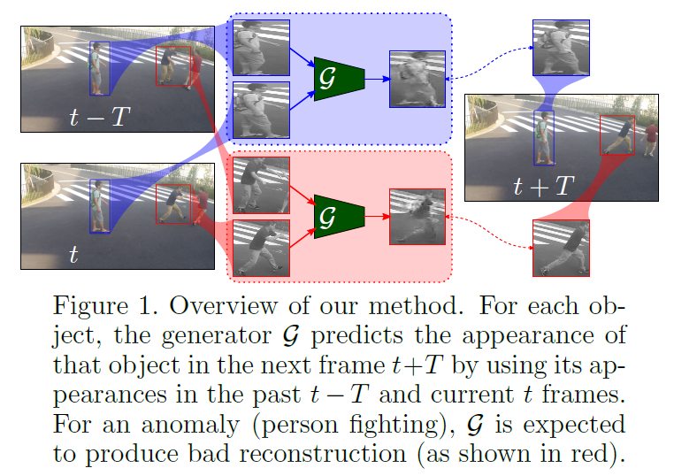
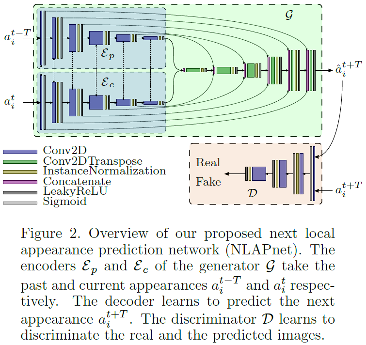

# Predicting Next Local Appearance for Video Anomaly Detection
This repository contains the source code of [Predicting Next Local Appearance for Video Anomaly Detection, accepted for MVA 2021](https://arxiv.org/pdf/2106.06059.pdf) by Pankaj Raj Roy, Guillaume-Alexandre Bilodeau and Lama Seoud. The corresponding slides, poster and video will be available soon.
<p align="middle">
  
  
</p>

We used TensorFlow/Keras to implement our proposed framework. Please follow the given instructions to run the code.

## 1. Installation (using Anaconda)
* Install Anaconda with Python 3.6 (since our code uses f-string)
* Install TensorFlow v1.12.0 and Keras v2.2.4
* Install keras-contrib (necessary for using InstanceNormalization layer and SSIM loss):
```shell
pip install git+https://www.github.com/keras-team/keras-contrib.git
```
* Install any other necessary libraries: scikit-learn, pandas, matplotlib, opencv-python, etc.

## 2. MOD Installation
* Follow the [instructions for installing CenterNet](https://github.com/xingyizhou/CenterNet/blob/master/readme/INSTALL.md). Note that we used PyTorch v1.0.1, Cuda v10 and GCC v4.9.1 in order to successfully install CenterNet.
* Define `CenterNet_ROOT` and `Pretrained_ROOT` in your `.bashrc` containing the path of the locally installed CenterNet repository and the pretrained weights respectively.
* Download the MS COCO pretrained weights corresponding to DLA and HG backbones which can be found in [Model zoo](https://github.com/xingyizhou/CenterNet/blob/master/readme/MODEL_ZOO.md): **ctdet_coco_dla_2x.pth** and **ctdet_coco_hg.pth**. Store them in `$Pretrained_ROOT/CenterNet/`.

## 3. Download Datasets
* Define `Datasets_ROOT` in your `.bashrc` containing the path location of datasets.
* Use the link provided by [StevenLiuWen](http://101.32.75.151:8181/dataset/) or by [BaiduYun](https://pan.baidu.com/s/1j0TEt-2Dw3kcfdX-LCF0YQ) (pass: i9b3) to manually download the four datasets: ped1.tar.gz, ped2.tar.gz, avenue.tar.gz and shanghaitech.tar.gz. Unzip each file and store them in `$Datasets_ROOT/`.

## 4. Data Preprocessing
* Define `Estimations_ROOT` and `Temp_ROOT` in your `.bashrc` containing the path of the estimated bounding boxes and the temporary folder respectively.
* Run the script `extract_estimations.py` for each dataset (ped1, ped2, avenue and shanghaitech (ST)) and for each MOD backbone (DLA and HG). For example, use the following arguments to extract bounding boxes for ST using DLA MOD backbone:
```shell
python extract_estimations.py -d shanghaitech --det_arch dla_34
```

## 5. Train from scratch
* To train the generative model from scratch, simply run the script `train_test_model.py` with arguments specifying the name of the dataset and the values of hyper-parameters. This will first train the model using the train set of the given dataset and then test the trained model using the test set of the same dataset. For example:
```shell
python train_test_model.py -d shanghaitech
```
* Once the training is complete, the models will be saved in `models/YYYY-MM-DD_HHhMMmSSs/` where `YYYY-MM-DD_HHhMMmSSs` specifies the time the script started. Once the testing is complete, the results will be saved in `results/train_test_model/YYYY-MM-DD_HHhMMmSSs/`.
* To reduce the resulting data size, we can increase the value of `frames_step`. For example, `--frames_step 10` will take a frame for every 10 consecutive frames for every video.
* To increase adversarial training stability, we employ some tricks like `n_inner_epochs` and `change_random_subset`. For example, `--n_inner_epochs 4` trains the discriminator for 4 epochs before training the generator for 4 epochs alternatively. `--change_random_subset` first trains the model on complete train set for 20 epochs and then changes the training data to a randomly selected subset of the complete train set for every 20 epochs.

## 6. Train from pretrained model
* To test this without training from scratch, download [the pretrained model on ST](https://polymtlca0-my.sharepoint.com/:f:/g/personal/pankaj-raj_roy_polymtl_ca/El3K4PzlxbFHqrYmQf67euMBItqQYlphntFx20R5vEEmWA?e=S7dLyv).
* For ped1, ped2 and avenue, use `n_frames_per_video` to specify the number of shots. For example, for testing adaptation performance on ped2, use the following commands for 1-shot, 5-shot and 10-shot respectively:

| Shots | Command |
|---|---|
| 1-shot | `python train_test_model.py --pretrained_model 2021-04-06_06h08m45s --random_subset_training -d ped2 --n_frames_per_video 1 --batch_size 4` |
| 5-shot | `python train_test_model.py --pretrained_model 2021-04-06_06h08m45s --random_subset_training -d ped2 --n_frames_per_video 5 --batch_size 16` |
| 10-shot | `python train_test_model.py --pretrained_model 2021-04-06_06h08m45s --random_subset_training -d ped2 --n_frames_per_video 10` |

## 7. Inference Mode Only
* To only test a pretrained model on a given dataset (e.g. ped2), use the following command:
```shell
python train_test_model.py --inference_mode --pretrained_model 2021-04-06_06h08m45s -d ped2
```
* Note that the minimum MOD detection scores (`min_train_det_score` and `min_test_det_score`) which ignores any bounding boxes having a MOD score lower `min_train_det_score` or `min_test_det_score` might affect the VAD performance significantly.

## Notes
* This code will soon be converted to the recent version of TensorFlow (2.5) which gives a significant boost in training speed of Keras model.
* More details coming soon.

## Citation
Please cite our paper if you find this useful.
```shell
@misc{roy2021nlap,
      title={Predicting Next Local Appearance for Video Anomaly Detection}, 
      author={Pankaj Raj Roy and Guillaume-Alexandre Bilodeau and Lama Seoud},
      year={2021},
      eprint={2106.06059},
      archivePrefix={arXiv},
      primaryClass={cs.CV}
}
```